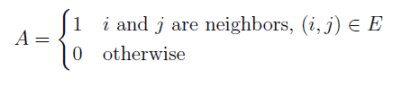
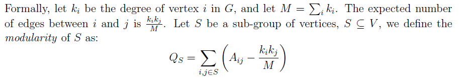
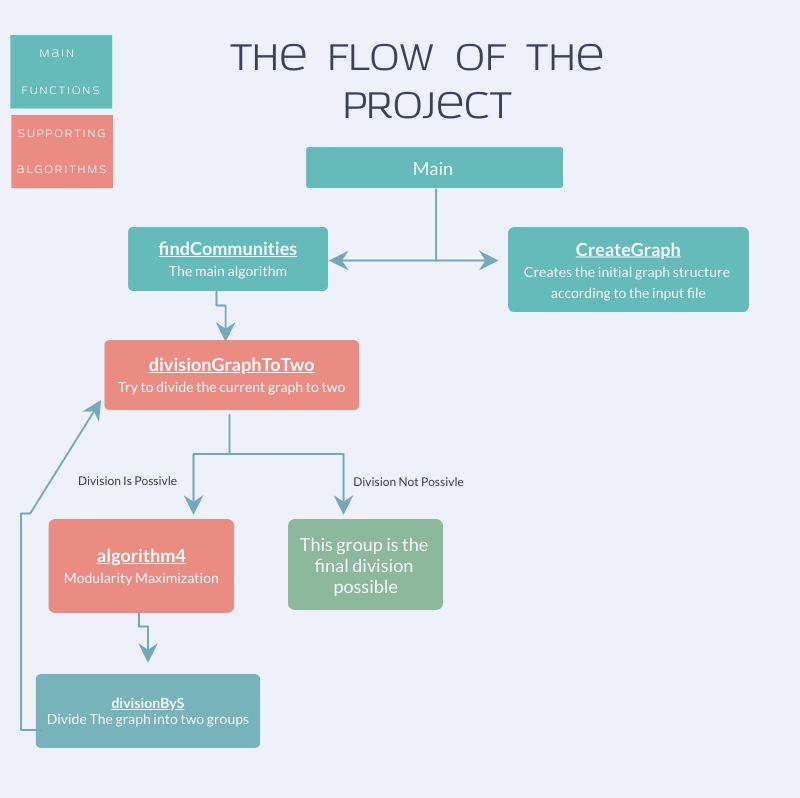
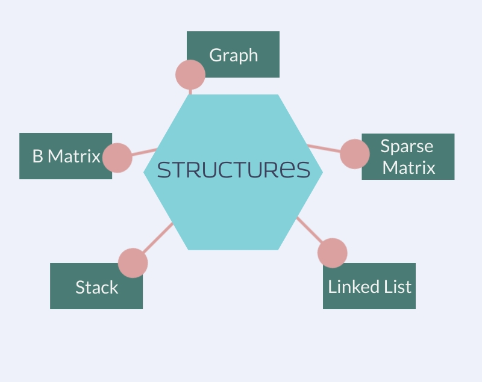

Community Structure in Networks
===================

> In complex networks, a network is said to have **community structure** if the nodes of the network can be grouped into groups of nodes with dense connections internally, and sparser connections between groups.

--------
Project Description
-------------
>This project contains implementation of the main algorithm for detecting community structures (or clusters) in a network. 
The ability to detect such groups is of significant importance.
> For example, partitioning a protein-protein interaction network into clusters can provide a modular view of the network, with different groups of nodes performing different functions within the cell.

--------
The Goal
-------------
> The goal in this project is to find a division that **maximizes the modularity**, that
is, a division of the graph into groups such that the modularity Q, the sum of all group
modularities, is close to maximal.

--------
The Mathematical Basis
-------------
> we represent a network by a graph G = (V,E), and let A be the adjacency matrix of G.

> A given group of vertices in a network is considered a **community** if the number of edges
within the group is significantly more than expected (by chance). We define the **modularity
of a group** as the number of edges within the group minus the **expected** number of edges in
a random graph with the same degrees.

> 

--------
Design
-------------
> 

> 

Executing the Project
-------------
> The name of the program is cluster.
It receives two command-line arguments:
The 1st is an input filename, and the 2nd is an output filename. 
The input of the program is a network (a graph), and the output is a list of groups (the division).
--------
File Format
-------------
The input and output files are both **binary** files consisting only of integers.
Binary files are not "human-readable" and cannot be edited in a text editor.
There are no lines, whitespace, or other separators, rather these files consist only of a stream
of bytes. The size of each value in the file is 4, the size of int on most machines.
This can be determined in code by sizeof(int).

Technology Wise
-------------
This project was created using C.
The projbect partitioned into fles (modules) and functions.
The design of the program, including interfaces, function declarations, and partition into modules, described below.
